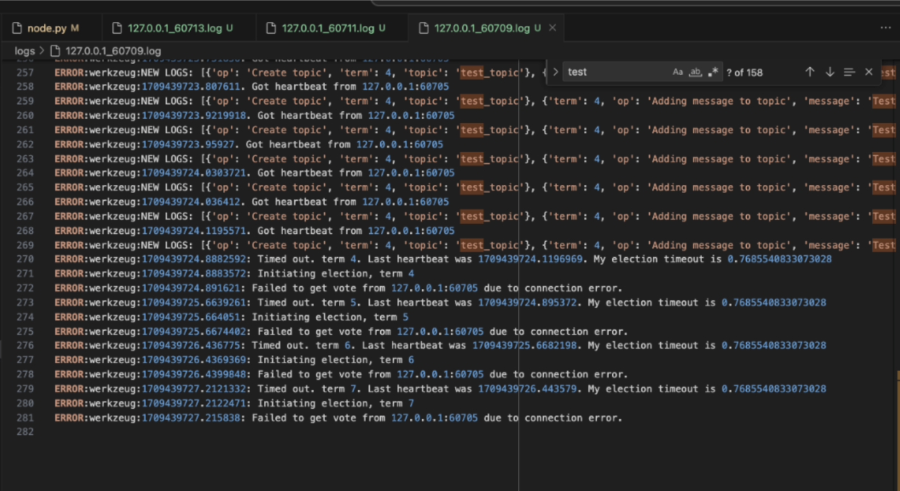
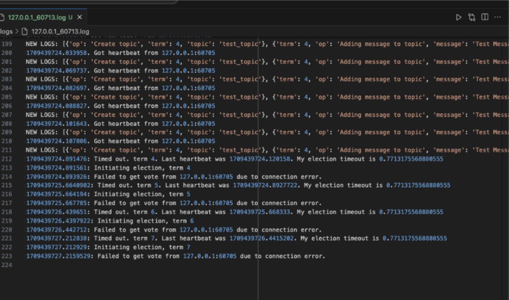

### Sources Used:
The raft paper (https://raft.github.io/raft.pdf) was our primary source in implementing our Raft REST Message Queue, and in order to understand the Raft algorithm we also used the Raft visualization on https://raft.github.io/, as well as the slides and recording from our class lecture about Raft. One external resource we used to understand the Raft algorithm (particularly the log replication part) was a lecture recording (https://www.youtube.com/watch?v=vYp4LYbnnW8), called Designing for Understandability: The Raft Consensus Algorithm, which was a lecture by Diego Ongaro, one of the authors of the Raft paper. In terms of implementing our algorithms, we used our code from the class exercises and homework assignments (such as the Flask class exercise) and the Raft Demo code (https://github.com/makslevental/raft_demo_mpcs2022) that we were shown in class. For the Message Queue implementation, we consulted https://flask-api.github.io/flask-api/api-guide/status-codes/ to understand which status codes would be appropriate for each response.

### Part 1. Message Queue ###
In this part of the project, we created a working message-queue implementation with the specified API. We closely followed the Rest API endpoint descriptions and response types that were given in the project description, using the hello_person.py class exercise as a model of how to create Flask Endpoints. In some cases, the response format was not specified in the project description, and we looked to the provided unit tests to understand what format should be returned. For example, in the get message endpoint, the project description did not describe if the response JSON should include an empty “message” field if “success” was False. We did not end up including the message field in this case, because we would not want the client to receive any message at all (even a blank one) if the node was not able to return a message, and this matched the unit test assertions that we were given. 

Out of an abundance of caution, we included a sleep of 0.01 seconds at the beginning of each view function. While this is not necessary for our tests to pass, we did this because our implementation relies on many global variables being set on start-up (like the node’s state, the empty topics list and message queue, the node’s commit index, and the node’s empty logs). If the endpoint gets called right on startup, we would want to make sure that there is enough time for the set of nodes to elect a leader, so that the leader can respond to the request if it is queried.  

For all the endpoints, if the node that receives the request is not the leader, it responds to the client with a “success” field set to “False”. As the “state” variable for a node is a global variable in our implementation, we use a lock to access this variable and check its value. This is a common pattern in our implementation, as we used locks to get and set global variables frequently in our multi-threaded program. We originally had our implementation redirect the request to the leader, which is how this scenario was described in the Raft paper, but we changed the behavior of our program based on the project description. Because the project description says that the client should receive an error when it sends a request to a non-leader node, we took that to mean that the client made an error in submitting this request, so the response included a 400 (Bad Request) status code. 

If the node that received the request was indeed the leader, our code checked that the JSON request had all of the correct fields, with the correct types in the field, and no extraneous fields. In some cases, like the get topic endpoint, our code checked to ensure that the request did not contain any JSON at all. If these conditions were not met, our implementation returned a 400 (Bad Request) status code to the client. In some cases, a 404 (Not Found) status code was sent to the client, such as when the client tried to add a message to a topic that didn’t exist, or retrieve a message from a topic that didn’t exist. 

Then, if a request was determined to be correctly formatted and sent to the leader, a log entry was made corresponding to the request, and that log entry was added to the leader’s logs. The index of the log entry was recorded as well. Then, (this part was only implemented later during the election/log replication steps), the leader sent out an append_entries request to each of its followers. If a majority of the followers successfully added the log to their logs, the leader’s commit index increased by 1 (if a majority of the followers did not successfully add the log to their logs, a 503 Service Unavailable response was sent back to the client). Each node has a separate thread (the apply_log_entries thread) that would continuously check if the commit index was greater than the index of the log entry that was last applied to the state machine. So in the view function, the program iterated in a loop with a maximum of 1000 iterations, and a 0.01 second sleep in between iterations, and in this loop it checked if the last applied index to the state machine was larger than the index of the log entry corresponding to the request. When this condition became true, the leader returned “success” = True and any other information (such as a message or topics list) to the client. The reason we used a loop with a maximum of 1000 iterations rather than a “while True” loop, was that we did not want the loop to run infinitely. We chose sleep times of 0.01 seconds because they are an order of magnitude lower than the election timeout (which we set to 0.3s-0.5s), which means that the delays in the loop would not accidentally cause another node to time out and initiate an election.

In the get_topic function, which was a read-only operation, we followed the Raft paper’s guidance on read-only functions. We did not create a new log entry for a get_topics request, and instead in this case we call a function that checks that the leader can successfully exchange heartbeats with a majority of the cluster, so it knows it has not been deposed before it reads its own stored topics list and returns that to the client. 

Throughout the message queue code, there are debug_print statements, which we used to log information about the program’s execution. This helped in our debugging. We used a logger with a lock so that the multi-threaded program could still output coherent logs.

A shortcoming of our message queue implementation (and in our Raft implementation as a whole) was our use of global variables to store values like the state and commit index of a node, because the necessarily multi-threaded nature of the Raft algorithm meant that we would constantly need to use Locks to access global variables, which could be costly in terms of performance. Using global variables with many threads could lead to bugs because many different threads are modifying the same variables, and it’s hard to guarantee that they acquire the locks in the correct order. Additionally, perhaps our view functions would execute faster if they directly called the method that checked if the commit index was larger than the last applied index and applied any committed logs to the state machine, rather than waiting for a separate thread to do that and having to continuously check if those changes were made. However, we deemed it most consistent with the description in the Raft paper to have a separate thread that would constantly check for and apply committed log entries.

### Part 2. Election ###

Three important variables for a node to store to help with the election process are current_term, voted_for, and the node’s logs. As described in the Raft paper, we saved current_term, voted_for, and the logs for each node onto a file in order to have them be stably stored. We did this in a thread that would save the persistent variables to a file every 0.01 seconds. Because these global variables were being updated in many places across our program, we chose to have a thread constantly writing the values to stable storage rather than making an explicit function call to write them to stable storage each time one of them was updated. This simplified our program, but it does mean that many expensive file writes are being done frequently by this thread, which could cause performance issues in a computer with limited processing capability. One implementation decision we made was to make voted_for a dictionary where the keys were term numbers and the value for each key was the server that the current node voted for in that term. In the Raft paper, voted_for was described as a variable that held one value at all times (the node that the current node voted for in the current term), but implementing it like this would lead to the added implementation complexity of having to make sure to reset voted_for to be null each time the term number changed, so we chose not to do this. Also, by creating one file per node to serve as stable storage for that node’s information (and one log per node), we ended up with a lot of files being created when we ran the entire test suite. In submission_test.py we clear the nodes and logs folders before any tests are run, but we did not want to modify the given test files, so a suggestion is that you clear the nodes and logs folders if you are rerunning any tests (so as not to have a node in one of the tests load in the values from a file that an old node with the same ip/port wrote to in an old test).

As soon as the program was started, the election_timeout_checker thread was started for each node. This started a loop that would check if the time since the last heartbeat was greater than that node’s election timeout, in which case it would initiate an election. We added a shortcut for the case when there was only a single node with no peers, in which case that node would immediately become leader rather than initiating an election (since if it initiated an election it would vote for itself, gain that majority vote, and become leader anyway). To initiate the election, we also had our program check that the state of the node was not already Leader (in which case it had nothing more to be elected to) or a Candidate (in which case it was already in the initiate_election() function, which has its own timeout based on the election timeout time, so it does not need to be called again). We tried various intervals for election timeouts, and settled on timeouts randomly chosen between 300-500ms, as those were below the 500ms election timeout which was the largest election timeout described in the Raft paper. Although our tests passed with even smaller election timeout intervals, we were worried that if we decreased the election timeout too much, it could become comparable to the broadcast times on slower machines, which would mean that heartbeats wouldn’t make it to followers, causing them to constantly time out and start new election cycles.

In the initiate_election function, we followed the paper’s specification on which variables to increment/update for a Candidate, and our program started new threads to send vote requests to each follower. When a node received a vote request, as described in the paper, it would grant a vote if the term of the Candidate was >= the node’s term and if that node had not yet voted in this term (tracked using the voted_for dictionary) and if the logs of the candidate were at least as up to date as the voter node’s log.
 
While the threads that were sending vote requests to each peer node were executing, the candidate would loop (using the same 1000-max-iteration loop with a small sleep interval between iterations as described above) through a few steps. First, it would check if its state was no longer a candidate (for the case when another node won an election and became leader, thus demoting the candidate node to be a follower). Then, it would check if the election timeout had passed since initiating the election, in which case it would need to start a new election. Lastly, it would check if it received enough votes to win the election (with a majority of nodes voting for it), in which case it would become the leader. An interesting bug we observed was that sometimes two nodes would initiate elections at almost the same exact time, and they had randomly generated election timeouts that were almost the same (up to within hundredths of a second of each other). This meant that when these two nodes initiated elections at the same time, they would keep splitting the votes, timing out at almost the same exact times, and then they would initiate a new election, split the votes again, and continue with this. This meant that a new leader would not be chosen for many terms, and many of the unit tests that only waited a few seconds for a leader to be chosen, would fail.

Here are screenshots of the logs from one instance when this bug occurred:

As you can see, in the top log, the node had a randomly generated election timeout of 0.768s, and the node on the bottom log had an election timeout of 0.771s. The nodes timed out within 0.01ms of each other and kept splitting votes and initiating new elections. To combat errors like this, we added a random sleep time of between 0 and 0.3 seconds (less than their election timeouts would be) before a node could initiate a new election when it timed out without winning its current election. This seemed effective in mitigating situations like the above, because if their randomly generated election timeouts were very close, this extra randomly generated sleep time would make it less likely that they would initiate the next election at the exact same time.

Once a node got enough votes to become the leader, its global state would get updated to be Leader, and it would update next_index and match_index, as those are reinitialized after election (as described in the Raft paper). Then, it starts a new thread for each peer, in which to send heartbeats to that peer. We chose a heartbeat frequency of 0.01 seconds, as that was an order of magnitude lower than the election timeouts. However, from the logs (where we recorded heartbeats sent and received and their timestamps), we noticed that heartbeats were really only sent every 0.05 to 0.1 seconds. This was likely due to the limited processing capability in our laptops and the limited broadcast speed of the heartbeats, where the same processor had to execute multiple threads in an interleaved manner, and also might have taken time for the heartbeat to be sent and received in the different ports. We noticed that when our program had many threads running at a time (such as when the client requested a message to be added, causing append_entries calls to be made to each node), heartbeats were sent even less frequently. Occasionally (although quite infrequently) this caused flaky failures in our test results, as a node’s election timeout would elapse because it didn’t receive a heartbeat in time, and it would initiate an election even though the past leader was still alive and trying to send heartbeats. This could cause the old leader to be deposed while it was servicing a client’s request, causing the response to the client to fail. This is one of the shortcomings of our implementation, and the only way we could think to fix this would be to use a computer with greater processing capabilities. However, we haven’t seen this flaky failure in the last 20-30 runs of our test suite, so we’re not sure if it was resolved by a change we made in the code or if it is still a potential issue.

We implemented heartbeats using an append_entries call without any entries, as specified in the Raft paper (except we used REST rather than RPCs for messaging, in order to keep our entire program consistently using REST). As described in the paper, receivers of these append_entries messages would update their logs and commit indices based on information sent by the leader, and would respond to the leader with an updated term if the leader’s term was lower than the receiver’s term (causing the leader to be made a follower). 

### Part 3. Distributed Replication Model ###
For the log replication part of the project, we implemented two threads that were involved with log replication and that would run for the duration of a node. The first thread (the apply_log_entries) thread constantly checked if the commit index was greater than the index last applied to the state machine, and would apply committed entries in order to make these two indices match. The second thread (the update_commit_index) was only relevant for the leader, and it would update the leader’s commit index if there was an index higher than the leader’s current index that was replicated on a majority of servers (and was from a log entry that was added during the current leader’s term). 

Log replication was initiated from the view functions that handled client requests. When the leader received a request from a client, the leader would add the request to their log and send an append_entries request to each peer for the peer to add the new entries to their logs. When the leader called the send_append_entries function, it would start a new thread for each peer, in which it would look up in the next_index dictionary the index of the next log entry to send to that server, then it would send entries past that index, as well as the previous entry, leader ID, leader term, and leader commit. 

On the receiver side of the append_entries request, the node updates its logs and commit index based on the information sent by the leader, and responds with a failure if the leader’s term is out of date or the node doesn’t have a previous log index that corresponds to the leader’s current log index.

When the leader received responses from the append_entries request, it would update the values of the global variables append_entries_successes or append_entries_failures (which were re-set to 0 every time the leader dispatched a batch of append_entries requests to all the peers) so it could count the number of successes and failures (failures being that the leader’s term was not as up to date as the receiver’s). If the append_entries request to one peer did not succeed because the peer did not have the same previous log entry as the leader, the leader would decrement next_index for that peer and try again (essentially rolling back the logs and trying to append entries from there). 

While all of this was happening with one thread executing per peer that append_entries requests were being sent to, the leader in its own thread (the original thread that received the client request) would periodically check if append_entries_successes or append_entries_failures was greater than or equal to a majority of the number of nodes in the configuration. If this condition was met, the leader would immediately respond with a success or failure, respectively, to the client. Meanwhile, any remaining append_entries threads could keep executing. 

A shortcoming of this implementation is that each batch of append_entries requests creates many threads that are never joined. The reason that they are not all joined is that leaders will continue to send append_entries requests to servers until their logs are up to date, which could mean many requests, and we wouldn’t want the leader to have to wait for that to finish in its main thread. When clients make multiple requests to a leader, the number of threads that are created and started becomes very high, which has made the program relatively difficult to debug and could create non-deterministic flaky behavior. We tried to use locks on global variables to reduce the chance of any non-deterministic behavior occurring, and this led to a slowdown in the running of our code because each function would need to wait for multiple locks to be acquired. 
